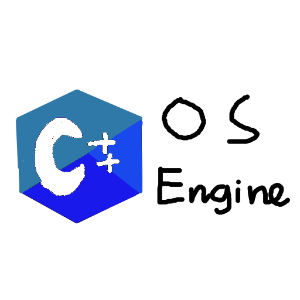

# C++OSEngine [Full name: C++ Operating System Engine]
A toolkit (not really) that using C++ to create an OS.


INFO: Some of the function in this Engine might not worked like:
  ATA Harddrive, MBR, Sound driver, FAT, FileSystem, Mouse, GUI (still in development).

INFO: Debugger hasn't support yet.

*HOW TO BUILD* >*For Linux Only*<:
* 1: Extract zip file after you downloaded it (using Terminal or File Manager or Extractor programs). <if you use git, you can skip this step>
* 2: open the terminal, go to the project directory and type 'make' to build the project.
* 3: to install the project, run 'make install' or 'sudo make install'.

*CODE*
```cpp
/*
#include <Kernel/console.h>
#include <Kernel/strings.h>
#include <Kernel/utils.h>
#include <Kernel/kernel.h>
*/
//For convenient, include this instead.
#include <Kernel/Core.h>

class Main : public kernel {
  public:
    void BeforeStart() override { //optional
      //add code here
    }
    void Start() override { //important
      //add code here
    }
    /*
      to halt the kernel with custom code, use:
      */
    void AfterStart() override { //also optional
      //add code here
    }
};

extern "C" void main_kernel() { //this can be changed in boot.asm from source code

  //Bacase the startup script isn't used, so install GDT, IDT in this line bellow.
  GDT::Init();
  Interrupt::idt_install();
  InterruptRequiests::Init();
  InterruptServiceRoutines::Init();  
  Main main;
  kernel* kernel = &main;
  kernel->BeforeStart();
  while(1) {
    kernel->Start();
  }
  kernel->AfterStart();
}

```

There is no builder yet, so use this command to build instead:
```
g++ -m32 -c <mainfile>.cpp -o <kernelfilename>.o -fno-stack-protector -fno-use-cxa-atexit -nostdlib -fno-builtin -fno-rtti -fno-exceptions -fno-leading-underscore
ld -m elf_i386 -static -pie --no-dynamic-linker -T <object_path>/linker.ld -o kernel.bin <object_path>
```
* usually object_path can be found in /opt/CppOSEngine.
* if you install the program to another path, change object_path to your path.

***SOME FILE (OR CODE) BASED ON OTHER GITHUB REPOSITORY , OFFICIAL OSDEV WEBSITE (wiki.osdev.org) AND OSDEVER.NET***

***THIS PROJECT USE MIT LICENSE***
